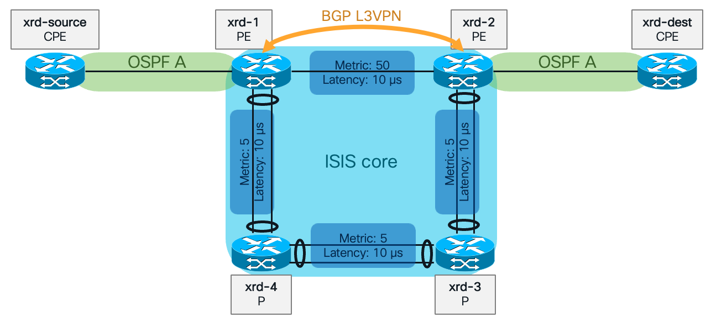
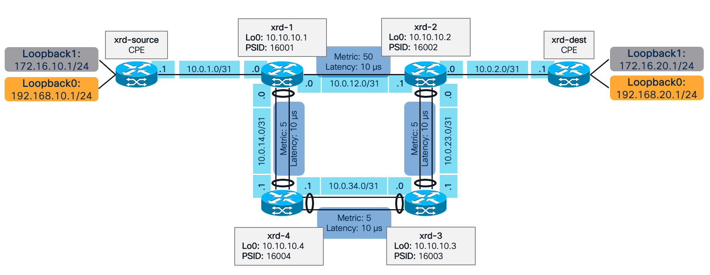

Made with [Antoine Orsoni](https://github.com/AntoineOrsoni)

# Introduction

This repository contains the exercises for the Cisco Live Instructor Led Lab session **LTRSP-3589** — From Manual to NetOps: Accelerating IOS XR Feature Validation with Python & pyATS.

This lab is an introduction to the pyATS framework, and how to use it to automate network testing and feature validation.

# Prerequisites

- Intermediate Python knowledge (condition, loop, class, object concepts)
- Basic knowledge of Cisco IOS XR CLI

# Exercises

This lab is composed of three main sections that start introducing the pyATS framework and its main building blocks and slowly moves to more advanced capabilities:

0. **Basic Interaction**: Connect to a device, execute a CLI command, get a structured output and print differences between two configurations.
1. **Sanity Check**: Build and run a sanity check with AETest that ensure the device is running the correct version and has the correct IGP configuration.
2. **Feature Validation**: Leverage AEtest to run a SR-TE policy validation, use EasyPy to scale up and run multiple validations serially or in parallel.

Each section and exercise are meant to be solved in order as they build on top of each other. However, it is not required to fully finish an exercise to move to the next one. Solution examples are provided for each exercise.

## Structure

There is one folder per exercise. Each exercise folder contains a README, that describes the steps to complete, an `exercise` folder and a `solution_example` folder.
The `exercise` folder contains the main Python script that need to be modified to complete the exercise. It may also contain other files that are required for the exercise (such as the testbed or a config snippet).
The `solution_example` folder contains a proposition of solution for the exercise, it is surely not the only way to solve the exercise and it also may not be the best way to do it. It is only provided as an example on how the exercise can be done.

Below is an example of an exercise folder structure:

```
0_connect/
├─ exercise/
│  ├─ 0_connect.py
│  ├─ testbed.yaml
├─ solution_example/
│  ├─ 0_connect.py
│  ├─ testbed.yaml
├─ README.md
```

## Instructions
Complete instructions can be found in the different exercise folders.

0. [Basic Interaction](0_basic_interactions/) 
    1. [Connect](0_basic_interactions/0_connect/): Connect to a device
    2. [Execute Command](0_basic_interactions/1_execute_command/): Execute a CLI command on a device
    3. [Structured output](0_basic_interactions/2_structured_output/): Parse a CLI command to a structured output
    4. [Config Diff](0_basic_interactions/3_conf_diff_bonus/): Print the difference between two configuration sets
1. [Sanity Check](1_sanity_checks/) 
    1. [Check Version (static)](1_sanity_checks/0_aetest_check_version_static/): Build an AETest script to check the device version against a static variable
    2. [Check Version (testbed)](1_sanity_checks/1_aetest_check_version_testbed/): Build an AETest script to check the device version against a variable in the testbed file
    3. [Check version and IGP](1_sanity_checks/2_aetest_check_version_and_igp_bonus/): Build an AETest script to check the device version and IGP configuration
2. [Feature Validation](2_feature_validation/) 
    1. [SR-TE Policy](2_feature_validation/0_sr_policy/): Build an AETest script to validate a SR-TE policy
    2. [Easypy](2_feature_validation/1_easypy/): Use EasyPy to run multiple AETest scripts: the sanity check and the SR-TE policy validation
    3. [Bonus: SR-TE policy with Netconf ](2_feature_validation/2_sr_policy_netconf_bonus/): Build an AETest script to validate a SR-TE policy using only NETCONF

# Lab 

## XRd

The lab is based on the latest containerized virtual IOS XR router from Cisco called **XRd**. XRd routers are production ready and can be used as SR-PCE, Route Reflector or Virtual PE.
They are also very handy for testing and learning purposes in lab as they are light and can be deployed in a few seconds using Docker or other container platforms.
XRd containers come in two flavors:
- Control Plane (with minimal forwarding plane functionality) which is used for signalling heavy applications like Route reflector, SR-PCE.
- vRouter (Control plane and the Forwarding plane bundled) which is suggested for Provider Edge

For lab purposes, the Control Plane is sufficient as there are no heavy forwarding required.

To find more information about XRd, please refer to the link below:

>https://www.cisco.com/c/en/us/support/routers/ios-xrd/series.html
> 
>https://xrdocs.io/virtual-routing/tutorials/   

## Topology

The lab is composed of 6 routers with different roles, two CPE, two PE and two P routers. The topology is as follows:



This topology can easily be launched with the `xr-compose` tools that helps create docker-compose file for XRd Control Planes.
The [xrd](xrd) folder contains the topology definition file [xr-compose.yaml](xrd/xr-compose.yaml) and the router configuration files.

The following command can be used to launch the lab topology (assuming that you have docker, XRd images, and xrd-tool installed):

```
./xr-compose -f xrd/xr-compose.yaml -o xrd/docker-compose.yaml -l
```

To find more information about `xr-compose` and other XRd tools, please refer to the link below:

>https://github.com/ios-xr/xrd-tools

## IP addressing

### Management

The router can be accessed using SSH. The management IP addresses are as follows:

| Name       | Management IP |
|------------|---------------|
| xrd-1      | 172.40.0.101  |
| xrd-2      | 172.40.0.102  |
| xrd-3      | 172.40.0.103  |
| xrd-4      | 172.40.0.104  |
| xrd-source | 172.40.0.201  |
| xrd-dest   | 172.40.0.202  |

### Loopbacks and interfaces

The diagram below details the IP addressing of the loopbacks and interfaces of the routers. On xrd-source and xrd-dest, loopbacks are used to simulate networks behind the CPE.



## Lab reset

Modifying router configuration is allowed during the lab. It can even be helpful to ensure our testing code works properly. 

You can go back to the default configuration by using the [reset_config.py](reset_config.py) script. This script will reset the configuration of all routers.

```
python reset_config.py
```

**Note**: Do not change management configuration!

# Dependencies

## Supported Python versions

You can find the list of supported Python versions for pyATS here:

> https://pubhub.devnetcloud.com/media/pyats-getting-started/docs/prereqs/prerequisites.html

At the time of writing, Python 3.12 was used.

## Libraries

It is recommended to use a virtual environment to install the required libraries. You can find more information about installing pyats in a virtual environment here:

>https://pubhub.devnetcloud.com/media/pyats-getting-started/docs/install/installpyATS.html

To install the required Python packages, please run the command below:

```
pip install -r requirements.txt
```

Those required libraries include pyATS packages (Unicon, Genie, Easypy), its dependencies and others libraries that are used in the suggested solutions for the exercises. Other libraries may be used to solve the exercises.

# Logging

In our exercises, we will use the `logging` Python module in order to log outputs.

The Python `logging` module provides several methods to log at different levels of severity. Here are the most common ones:

* `logger.debug(msg, *args, **kwargs)`: Records a message with level DEBUG on this logger. The msg is the message format string, and the args are the arguments which are merged into msg using the string formatting operator.
* `logger.info(msg, *args, **kwargs)`: Records a message with level INFO on this logger.
* `logger.warning(msg, *args, **kwargs)`: Records a message with level WARNING on this logger. This indicates a potential problem that should be taken note of.
* `logger.error(msg, *args, **kwargs)`: Records a message with level ERROR on this logger. This specifies a more serious problem that has prevented the program from performing a function.
* `logger.critical(msg, *args, **kwargs)`: Records a message with level CRITICAL on this logger. This indicates a very serious error, and may be the program's inability to continue to run.
* `logger.exception(msg, *args, **kwargs)`: This is a convenience method for logging an ERROR-level message with traceback information, which can be very useful when you're logging an exception.

The `logging` module consists of three main elements : 
 * **Logger**: This is the main object that your application code will directly interact with. Logger is the class object which we use to get the instance of the logger.
 * **Handler**: Handlers are responsible for dispatching the appropriate log messages (based on their severity) to the logger's specific destination. For example, it could be console (with StreamHandler) or a file (with FileHandler).
 * **Formatter**: Formatters specify the layout of log records in the final output. In other words, they set the string format that a handler uses to display a log record. They can add things like timestamp, line number, and other details to the output.

Using the `logging` module is recommended over using `print` statements as it provides more flexibility and control over the output. It is a standard way to print to screen but it can also very easily save the logging output to a file.

## PyATS logging
### Screenhandler
PyATS provides a formatter and a handler for you to use that adhere to Cisco logging standards.  You can find more information about them in the documentation below:
>https://pubhub.devnetcloud.com/media/pyats/docs/log/implementation.html

For simplicity and ease of use, the pyATS ScreenHandler is used in all examples.  This handler will print all log messages to the screen. 

### Utilities

A few logging utilities are also provided to display banners and titles and limit the size a logging line. You can find more information about them in the documentation below:
>https://pubhub.devnetcloud.com/media/pyats/docs/log/utilities.html

### Example

Below is an example on how to use the pyATS logging handler and the different utilities
```python
from pyats.log import ScreenHandler
from pyats.log.utils import banner,title
import logging

logger = logging.getLogger(__name__)
logger.addHandler(ScreenHandler(coloured=True))
logger.setLevel(logging.INFO)
logger.info(title('This is a title'))
logger.info("This is a simple log message")
logger.info(banner('This is a banner'))
logger.warning("This is a warning message")
logger.critical("This is a critical message")
```
And the output produced:
```
2023-10-31T14:57:45: %SCRIPT-INFO: ================================This is a title=================================
2023-10-31T14:57:45: %SCRIPT-INFO: This is a simple log message
2023-10-31T14:57:45: %SCRIPT-INFO: +------------------------------------------------------------------------------+
2023-10-31T14:57:45: %SCRIPT-INFO: |                               This is a banner                               |
2023-10-31T14:57:45: %SCRIPT-INFO: +------------------------------------------------------------------------------+
2023-10-31T14:57:45: %SCRIPT-WARNING: This is a warning message
2023-10-31T14:57:45: %SCRIPT-CRITICAL: This is a critical message
```

# pyATS Documentation

## Official documentation

pyATS documentation can be found here:

> https://pubhub.devnetcloud.com/media/pyats/docs/getting_started/index.html

## Genie Parsers Documentation

> https://pubhub.devnetcloud.com/media/genie-feature-browser/docs/#/parsers

## AEtest documentation

> https://pubhub.devnetcloud.com/media/pyats/docs/aetest/index.html

## Tips and tricks 

The following article covers a few tips and tricks that you may find useful when starting with pyATS, it also contains common errors that can be encountered and how to solve them:

>https://xrdocs.io/programmability/tutorials/pyats-series-tips-and-tricks/

# License

This project is covered under the terms described in [Licence](LICENSE)
